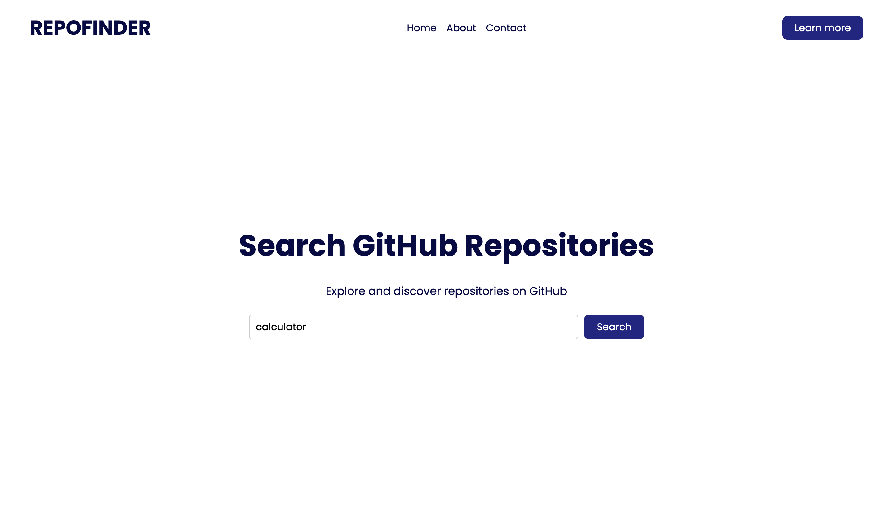
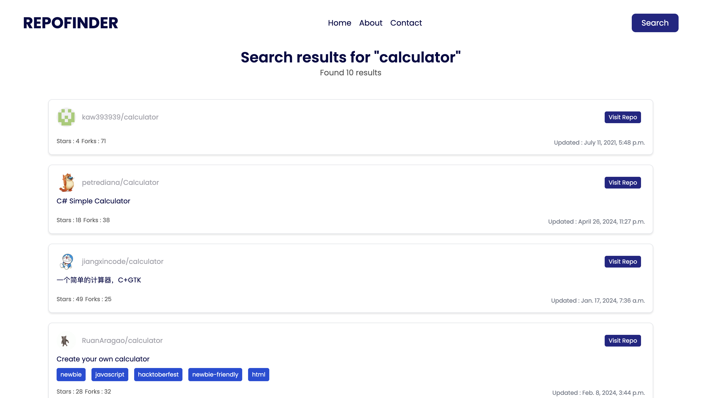

# Github RepoFinder

###  This repository contains a web application built with Django, which interfaces with a third-party API. It enables users to interact with the API's data, storing and retrieving information from a relational database.

## Prerequisites

- Python 3.x
- Django 4.x

## Project Setup

```code
git clone https://github.com/fayiskodiyil/PythonAssessmentSubmissionRepo

cd PythonAssessmentSubmissionRepo/

# Create a virtual environment
python3 -m venv env

# Activate the virtual environment
# For Windows:
# .\env\Scripts\activate
# For macOS/Linux:
# source env/bin/activate

# Install required dependencies
pip install -r requirements.txt

# Make migrations & migrate
python manage.py makemigrations
python manage.py migrate

# Run the Django server
python manage.py runserver

# For running tests
python manage.py test

```

## Working Examples



